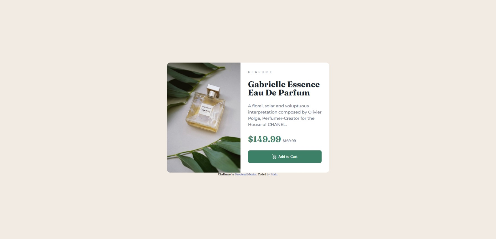
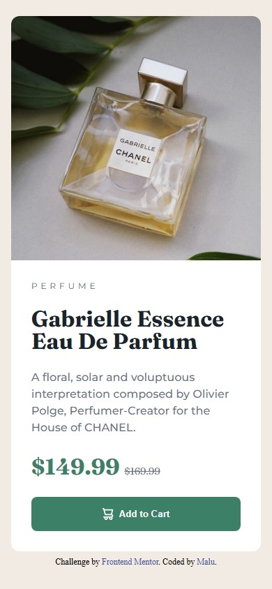

# Frontend Mentor - Product preview card component solution

This is a solution to the [Product preview card component challenge on Frontend Mentor](https://www.frontendmentor.io/challenges/product-preview-card-component-GO7UmttRfa). Frontend Mentor challenges help you improve your coding skills by building realistic projects.

## Table of contents

- [Overview](#overview)
  - [The challenge](#the-challenge)
  - [Screenshot](#screenshot)
  - [Links](#links)
- [My process](#my-process)
  - [Built with](#built-with)
  - [What I learned](#what-i-learned)
- [Author](#author)
- [Tech Stack](#%EF%B8%8F-tech-stack)

## Overview

### The challenge

Users should be able to:

- View the optimal layout depending on their device's screen size
- See hover and focus states for interactive elements

### Screenshot

<div align="center">
  
  
</div>

### Links

- Solution URL: [GitHub Pages](https://maluwhoo.github.io/Frontend-Mentor-Product-Preview-Card/)
- Live Site URL: [Frontend Mentor]()

## My process

### Built with

- Semantic HTML5 markup
- CSS (including Flexbox for layout)
- Mobile-first workflow / responsive design
- `<picture>` element for responsive images
- Hover states for interactive elements

### What I learned

During this project, I learned how to use the `<picture>` element to display different images depending on the screen size. This allows you to serve a **mobile version** and a **desktop version** without having to add two separate `` tags in the HTML.  

```html
<picture>
  <!-- mobile - sem precisar colocar 2 imagens -->
  <source media="(max-width: 470px)" srcset="images/image-product-mobile.jpg">

  <!-- Desktop (acima de 471px) -->
  <source media="(min-width: 601px)" srcset="images/image-product-desktop.jpg">
  
</picture>
```
```css
picture {
    flex: 1;
}
```

## Author

- Website - [Malu's GitHub](https://github.com/MaluWhoo)
- Frontend Mentor - [@MaluWhoo](https://www.frontendmentor.io/profile/MaluWhoo)

## 🛠️ Tech Stack


